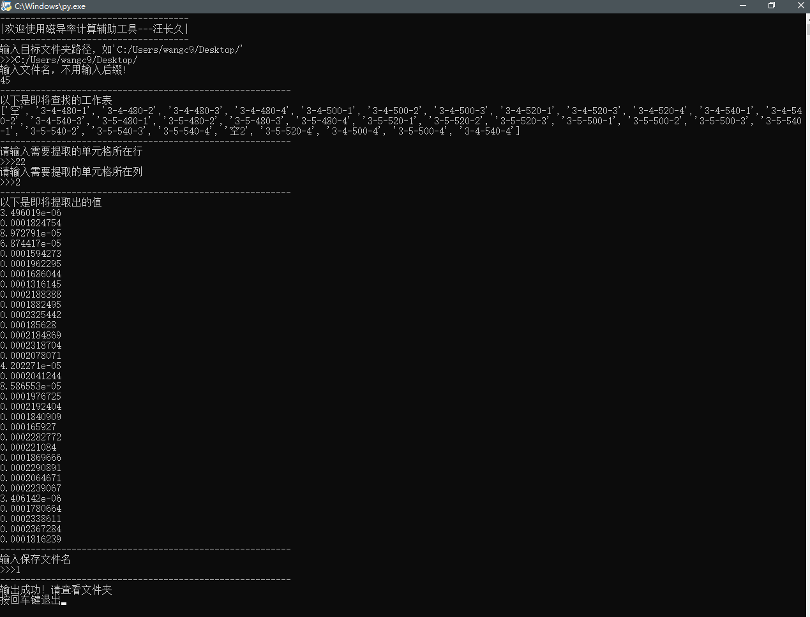

# 利用python提取excel表格每个sheet中特定位置的数据

在实验中需要从仪器导出的excel中提取大量数据，这是一份非常枯燥的工作。

为了节省时间，我决定写一个小程序。

首先观察excel的结构吗，发现每一次实验在excel中都会生成一个sheet，每个sheet中都会有一列数据，我们需要提取每个sheet中特定单元格的值，并与sheet名对应。

很明显这用循环函数便可轻松完成。

代码如下：

```python
import pandas as pd #载入pandas库
import numpy as np
import os
print("-------------------------------------")
print("|欢迎使用磁导率计算辅助工具---汪长久|")
print("-------------------------------------")
print("输入目标文件夹路径，如'C:/Users/wangc9/Desktop/'")
path = str(input(">>>"))
#读取文件
address = str(input("输入文件名，不用输入后缀! \n"))
print("---------------------------------------------------------")
address = path + address+".xls"
f = pd.ExcelFile(address)

#提取sheet名
sheetname=f.sheet_names

#删去文件中多余的sheet
for b in sheetname:
    if  "Sheet" in b:
        sheetname.remove(b)

for b in sheetname:
    if  "Sheet" in b:
        sheetname.remove(b)

print("以下是即将查找的工作表")
print(sheetname)
print("---------------------------------------------------------")
#读取需要提取的行列值
row = int(input("请输入需要提取的单元格所在行\n>>>"))
row = row - 2
line =int(input("请输入需要提取的单元格所在列\n>>>"))
line = line -1

#建立一个list来存放电感的值
mag=[]
print("---------------------------------------------------------")
#按sheet读取工作表,并将每一工作表中的特定单元格的值存储在链表mag中
print("以下是即将提取出的值")
for i in sheetname:
        df = pd.read_excel(address,sheet_name=i)
        value = df.iloc[row,line]
        print(value)
        mag.append(value)
print("---------------------------------------------------------")

#将sheet名和mag合并
me = list(zip(sheetname,mag))

#输出文件

# list转dataframe
workbook = pd.DataFrame(me,columns=['sheet名','磁通'])
# 保存到本地excel
name = str(input("输入保存文件名\n>>>"))
name = name +".xls"
print("---------------------------------------------------------")
os.chdir(path)
workbook.to_excel(name, index=False)
print("输出成功！请查看文件夹")

input("按回车键退出")

```

这样一个简易的python程序就写出来了。

然鹅，怎么让没有编程基础的同学都用上这个程序呢？这时候就要把它封装成windows的应用程序。

为此我们需要用到第三方库Pyinstaller，具体教程参考[这位答主的文章](https://zhuanlan.zhihu.com/p/61965739)，最终运行结果如图所示。



